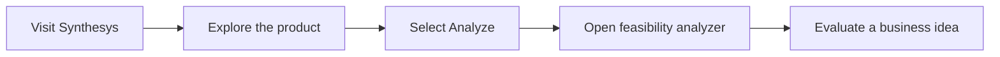

<div align="center">

# SYNTHESYS

<br>

[](https://significant-need-954848.framer.app/)
[](https://suhaniibalchandanii.github.io/Synthesys/frontend/analyze.html)


### Find the right business, in the right place, at the right time.

</div>

---

## About Synthesys

**Synthesys** is the frontend landing experience for an AI-powered business
feasibility tracker. It introduces the product, communicates its value
proposition, and guides users to the separate analysis interface.

The product is designed around a simple goal: help users examine a business idea
and identify whether it can address a meaningful demand gap.

## What this repository contains

This repository contains the exported **Synthesys landing page**:

- Product introduction and animated hero section
- Direct CTA to the feasibility analyzer
- Responsive navigation for desktop, tablet, and mobile
- Interactive particle-based background
- Framer Motion entrance and transition effects
- Embedded audio player
- About, contact, blog, and call-booking navigation
- Search-engine and social-sharing metadata

> [!NOTE]
> The feasibility-analysis interface is hosted separately at
> [`Synthesys/frontend/analyze.html`](https://suhaniibalchandanii.github.io/Synthesys/frontend/analyze.html).
> This repository currently contains the public-facing landing page rather than
> the analyzer's source code.

## User flow



## Design highlights

| Element | Implementation |
|---|---|
| **Visual identity** | Dark interface with purple `#814AC8` and lilac `#DF7AFE` accents |
| **Hero** | Large animated typography and product CTA |
| **Background** | Canvas-based particle field, gradients, and layered circular forms |
| **Interactions** | Framer-generated animations, hover states, and transitions |
| **Typography** | Figtree and Inter |
| **Media** | Embedded 1:34 audio experience |
| **Responsive design** | Dedicated breakpoints for desktop, tablet, and mobile |

## Technology stack

- **Framer** for visual design, responsive components, and publishing
- **HTML5** for the exported document structure and metadata
- **CSS3** for layout, design tokens, responsive rules, and effects
- **JavaScript** for runtime behavior and interactive modules
- **Canvas** for the animated particle background
- **Framer Motion** for transitions and entrance animations
- **Framer CDN** for fonts, runtime modules, and media assets

## Repository structure

```text
Synthesys_Frontend/
├── assets/
│   └── synthesys-readme-banner.svg
├── index.html
└── README.md
```

`index.html` is a production export generated by Framer. Its styles, component
markup, metadata, responsive variants, and runtime bootstrapping are bundled
into a single file.

## Run locally

### 1. Clone the repository

```bash
git clone https://github.com/suhaniibalchandanii/Synthesys_Frontend.git
cd Synthesys_Frontend
```

### 2. Start a static server

```bash
python3 -m http.server 8000
```

### 3. Open the page

Visit:

```text
http://localhost:8000
```

An internet connection is required because the Framer export loads runtime
modules, fonts, and media from external CDN resources.

## Important route notes

The landing page contains both local and external links:

| Link | Destination |
|---|---|
| **Home** | Current landing page |
| **About** | Suhani Balchandani’s portfolio |
| **Analyze** | Externally hosted Synthesys analysis page |
| **Book a call** | Cal.com |
| **Contact** | Local `/contact` route |

> [!IMPORTANT]
> Only `index.html` is currently tracked in the original repository. The local
> `/contact` route will require a corresponding exported page before it works on
> a static deployment.

## Deployment

The canonical Framer deployment is:

**[significant-need-954848.framer.app](https://significant-need-954848.framer.app/)**

The landing page can also be deployed through GitHub Pages:

1. Go to the repository’s **Settings**.
2. Open **Pages**.
3. Choose **Deploy from a branch**.
4. Select `main` and `/ (root)`.
5. Save and wait for the deployment URL.

For complete navigation on a static host, export and commit every local route
referenced by the page.

## Project status

This repository represents the frontend presentation layer of Synthesys.
Business-analysis logic and data processing are outside the scope of this
repository. The landing page is suitable as a product introduction and gateway
to the separately hosted analyzer.

## Author

Developed by **Suhani Balchandani**.

- [GitHub](https://github.com/suhaniibalchandanii)
- [Portfolio](https://suhaniibalchandanii.github.io/SuhaniBalchandani/)

---

<div align="center">

**Powered by my friend — AI ✦**

© Suhani Balchandani

</div>
